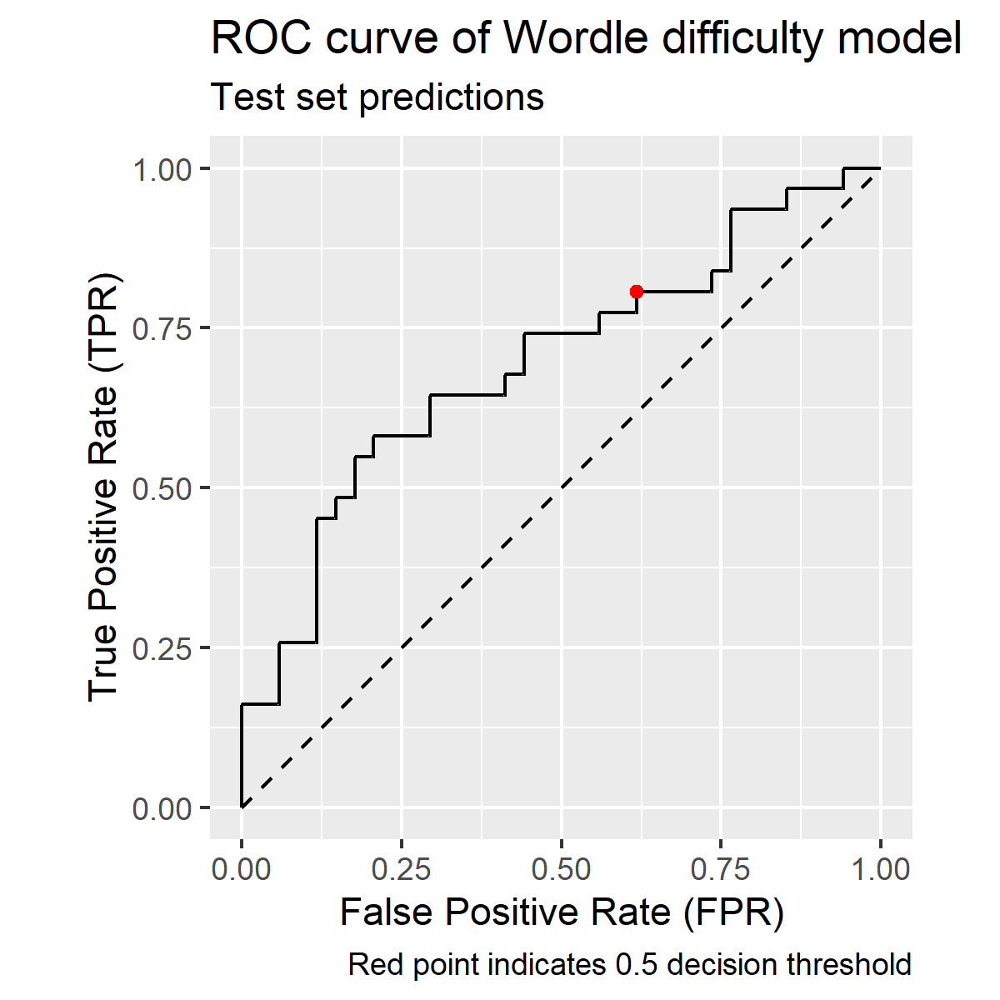

```{r set-options, include=FALSE}
knitr::opts_chunk$set(echo = TRUE, comment = NA)
knitr::opts_chunk$set(fig.width=4.5, fig.height=3.5)
options(dplyr.summarise.inform = FALSE, tidyverse.quiet = TRUE, width = 120)
```


## 🟩 The story of Wordle

The [Wordle](https://www.nytimes.com/games/wordle/index.html) is a web-based word game created and developed by Welsh software engineer Josh Wardle.  
It has become incredibly popular, thanks to its simplicity, playability and challenge... and also because players around the world can show off their prowess on by posting their daily results on social media as emoji squares.

The aim of the game is to guess a five-letter word using a maximum of six attempts.  
There is a unique "wordle" every day and the rules are simple.  
After every guess you receive feedback for each letter in your guess in the form of a coloured square:  
⬛ means the that the letter is not in the word   
🟨 means the letter is in the word but in a different position to the one you chose.  
🟩 means the letter is in the word in the position you chose.

This Assessment asks you to investigate the results posted by a sample of Australian and international players.

* What makes a word hard to guess?
* How many guesses does it take to crack the puzzle?
* And, critically, which Australian state or territory can boast the best wordlers?

...your data awaits...

# Instructions

## 📢 About this Assessment item

* This individual assignment is designed to evaluate, among other things, your abilities to
    *  apply your data manipulation knowledge and skills on real datasets
    *  read, interpret and follow instructions about working with data
    *  identify and explain critical ethical issues in data science scenarios
    *  look things up and figure things out.
        * Note that **Blackboard/References** provides advice and useful references for looking things up
* Details about the weighting and due date can be found at **Blackboard/Assessment02**
* We have attempted to make this Assessment perfect
    * However, because we are running it for the first (and last!) time we may need to make corrections
    * Any corrections or clarifications will be published in **Blackboard/Assessment02/Errata** 
    
## 📩 How to submit this Assessment item

* Question 6 provides instructions as to how to submit this Assessment item.
  * Correctly following these instructions is worth 1 mark.

## 😎 How to succeed with this Assessment item

* We expect you to answer all questions.
    * Remember, the more you give us, the more opportunity we have to award marks
    * If you are encountering difficult circumstances,
    [here is information about applying for an extension](https://ask.qut.edu.au/app/answers/detail/a_id/217/~/how-do-i-apply-for-an-extension-on-my-assignment%3F)
        * Note that it is QUT (not the DSB100 Teaching Team) who assesses extension requests
* We will release your marks on Blackboard as soon as we have received, marked and moderated all submissions, including extensions

## 🛠️ Work in a new directory, using relative file names

* Uncompress your Assessment files in a newly created directory
* Refer to files using names relative to the location of this R markdown document, e.g., `../data`, 
    * This will mean that the Teaching Team can run your submission in a new location

## 🏡 Work from home! 

* Don't change your working directory
  * This helps ensure that your code can be run without necessarily having to start from the top

## 🧹 Start with a clean environment

* It is good practice to make sure that our code runs in a "clean" environment
    * Here "clean" means free from R objects that are older than the code we are working on
    * Working in a clean environment means that our code runs from a well-defined initial state
    * If we forget to do this, it is easy to create code that relies on objects that we have left lying around
        * This code will fail when we give our code to someone else to run in their clean environment
* One simple way to ensure we start in a clean environment is to remove everything other than the code files we are working on:

```{r clean-start, class.source="bg-success"}
rm(list=ls()) # Remove all objects
```

* Notice that we've put code and output that we provide for you in green-shaded text boxes

## 📚 Load only these libraries

This assessment can and should be completed using only the following four libraries.

- Do not use any other libraries

```{r load-libraries, warning=FALSE, message=FALSE, class.source="bg-success"}
library('ggplot2')
library('dplyr') 
library('lubridate')
library('plotly')
```


## 🟨 Your datasets

This assessment uses two datasets of tweet data from wordle results which we load here:

```{r load-wordle-data, class.source="bg-success"}
wordle.int <- readRDS('../data/wordle.int.RDS') # A sample of 20000 wordle results from international players
wordle.aus <- readRDS('../data/wordle.aus.RDS') # A sample of 11389 wordle results from Australian players
```

Both `wordle.int` and `wordle.aus` contain the variables

- `wordle_id`: a unique consecutive identifier of the wordle.
- `solution`: the solution or wordle of the day: e.g. ``POWER``
- `date`: date of the published result by the user on Twitter.
- `attempts`: the number of attempts (out of 6) used to solve the wordle.
- `score`: the score achieved, where each  ⬛ = 2, 🟨 =  1 and  🟩 = 0. The smaller the better.
- `vowels`: number of vowels in the solution. It affects the difficulty of the guess. The ``Y`` is considered a vowel here.
- `repeated`: consecutive / double letters in the solution e.g. ``SWEET``. It affects the difficulty of the guess.
- `freq`: the log of the n-gram mean frequencies of the word (during the last 5 years).
  - This was obtained from Google Ngram Viewer website.
  - We expect that more frequently used words should be easier to guess.
- `wday`: day of the week (Mon, Tue, ..., Sun).
- `tweet`: a tweet spoiler-free emoji grid published by the users.

The Australian dataset, `wordle.aus` also contain the variable

- `city`: the city of the Twitter user. 


<details>
<summary>Click to show a glimpse of the international wordle data:</summary>

```{r glimpse-wordle.int, echo=FALSE, class.output="bg-success"}
glimpse(wordle.int)
```
</details>
<br>

```{r function-section.break, echo=FALSE}
# Draw a wordle-y section break
section.break <- function(){
  cat(
  sample(
    c("⬛","🟨","🟩"), 
    49, 
    replace=TRUE), 
  sep="")
}
```

```{r endIntro, echo=FALSE, class.output="bg-warning"}
section.break()
```

# ❔ Question 1: Summarizing wordle data (8 marks total)

This question asks you to summarise and explore the `wordle.int` dataset, a sample of 20,000 tweets about wordle from around the world. This kind of summarisation is a critical step in understanding any dataset.

## Q1.1

Demonstrate R commands to generate summary statistics for each wordle in the `wordle.int` dataset: 

  - group the data by `wordle`, `solution`, `vowels`, `repeated`, `freq`, and `wday` 
  - count the numbers of non-missing values for the `score` and for the `attempts` variable. 
  - compute the _mean_  of `score` and `attempts`
  - compute the _standard deviation_ of `score` and `attempts`
  - save your results to `wordle.int.summary` and print the first 10 rows of that object
  - your results should look like this:
  
<div style="text-align: right"> (**2 marks**) </div>


````{verbatim wordle.int.summary, eval=FALSE, class.source="bg-success"}
# A tibble: 216 x 12
# Groups:   date, solution, vowels, repeated, freq [216]
   date       solution vowels repeated  freq wday  score_n score_mean score_sd attempts_n attempts_mean attempts_sd
   <date>     <chr>     <int>    <dbl> <dbl> <ord>   <int>      <dbl>    <dbl>      <int>         <dbl>       <dbl>
 1 2022-01-15 PANIC         2        0 -16.5 Sat        67       18.5     7.39         67          3.78        7.39
 2 2022-01-16 SOLAR         2        0 -15.7 Sun        60       17.4     6.83         60          4.03        6.83
 3 2022-01-17 SHIRE         2        0 -18.7 Mon        45       13.3     7.29         45          3.44        7.29
 4 2022-01-18 PROXY         2        0 -17.6 Tue        50       25.1     8.31         50          4.72        8.31
 5 2022-01-19 POINT         2        0 -14.0 Wed        55       17.2     6.01         55          3.55        6.01
 6 2022-01-20 ROBOT         2        0 -16.6 Thu        57       20.1     8.82         57          3.91        8.82
 7 2022-01-21 PRICK         1        0 -18.6 Fri       145       18.3     7.29        145          3.85        7.29
 8 2022-01-22 WINCE         2        0 -20.8 Sat        59       21.8     7.99         59          4.39        7.99
 9 2022-01-23 CRIMP         1        0 -19.3 Sun       102       18.7     6.97        102          3.95        6.97
10 2022-01-24 KNOLL         1        1 -19.1 Mon        72       26.3     6.68         72          4.54        6.68
# … with 206 more rows
````


```{r Q1.1}
wordle.int %>%
  group_by(date, wordle_id, solution, vowels, repeated, freq, wday) %>%
  summarise(score_n = sum(!is.na(score)), score_mean = mean(score), score_sd = sd(score), attempts_n = sum(!is.na(attempts)), attempts_mean = mean(attempts), attempts_sd = sd(attempts)) -> wordle.int.summary

head(wordle.int.summary, 10)
```

<div class="alert alert-success">
  <strong>Note</strong> In case you cannot complete Q1.1, we now provide `wordle.int.summary` to be used from here on.
</div>

```{r import-wordle.int.summary, class.source="bg-success"}
wordle.int.summary <- readRDS("../data/wordle.int.summary.RDS") 
```

## Q1.2

Demonstrate R commands to show the proportion of wordles in `wordle.int.summary` containing different numbers of `vowels` , rounded to 3 decimal places, ensuring that any missing values (`NA`s) are included.
<div style="text-align: right"> (**1 mark**) </div>

```{r Q1.2}
# Write your answer here

table(wordle.int.summary$vowels, useNA = "ifany")
# We can use this table to obtain proportions by dividing each value by the total number of wordles in the data set. E.g. 
totalVowels = 50 + 136 + 29 + 1 # Values taken from above table function.
oneVowel = round((50/totalVowels), 3)
twoVowels = round((136/totalVowels), 3)
threeVowels = round((29/totalVowels), 3)
fourVowels = round((1/totalVowels), 3)

cat("Proportion of wordles containing one vowel: ", oneVowel, "\nContaining two vowels: ", twoVowels,
    "\nContaining three vowels: ", threeVowels, "\nContaining four vowels", fourVowels)

```

## Q1.3

Demonstrate R commands to show that there are 216 different days of results in `wordle.int.summary`
<div style="text-align: right"> (**1 mark**) </div>

```{r Q1.3}
# Write your answer here
n_distinct(wordle.int.summary$date)
```

## Q1.4

Demonstrate R commands that add a `month` variable to `wordle.int.summary` so you can answer the following question.

In July 2022, what was the hardest word, based on the mean number of attempts in `wordle.int.summary`  
(i.e., the more attempts the harder)? 
    * Hints:
      * Use `lubridate`'s  `month()` function.
      * `wordle.int.summary` is [a _grouped_ data frame](https://dplyr.tidyverse.org/articles/grouping.html)
      * Depending on your approach, you may have to remove the grouping to answer these questions
<div style="text-align: right"> (**1 mark**) </div>


```{r Q1.4}
# Write your answer here
wordle.int.summary <- wordle.int.summary %>%
  mutate(month = month.abb[lubridate::month(date)])

View(wordle.int.summary) # We manually view the data set to see which word in July 2022 has the highest mean number of attempts

print("Based on the above commands, the hardest word in July 2022 is 'Cinch' on the 26th, with a mean attempt of 4.55...")
```


## Q1.5

1. Using `wordle.int.summary`, demonstrate R commands that compute and display the following summary statistics, by month, for the `attempts_mean` variable: 
    - mean and the median.
    - standard deviation.
    - quartiles Q1 and Q3.
<div style="text-align: right"> (**1 mark**) </div>

<div class="alert alert-success">
  <strong>Note</strong> We have asked you to summarise the mean number of attempts of each wordle: in effect, you are providing summaries of a summary statistic. The results that you will get will be slightly different than if you were to work with the individual observations (i.e., the integer number of attempts in `wordle.int`). We have done this to avoid overplotting in Q1.6.
</div>


```{r Q1.5}
# Write your answer here
wordle.int.summary %>%
  group_by(month) %>%
  summarize(mean = mean(attempts_mean), median = median(attempts_mean), standard_dev = sd(attempts_mean), Q1 = quantile(attempts_mean, 0.25), 
            Q3 = quantile(attempts_mean, 0.75))
```


## Q1.6

Demonstrate R commands create violin plots of `attempts_mean` for each week day of the `wordle.int.summary` data

- draw the 0.25, 0.5 and 0.75 quantiles on the violins
- overlay these with blue, semi-transparent, horizontally jittered points (width=0.1)
- give the plot
  - the title "International Wordle data"
  - the subtitle "2022-01-15 to 2022-08-21"
  - no x-axis label
  - the y-axis label "daily mean number of attempts"
- ensure the y axis ticks are the counting numbers from 1 to 6
<div style="text-align: right"> (**1 mark**) </div>

```{r Q1.6}
# Write your answer here
ggplot(data=wordle.int.summary, aes(x = wday, y = attempts_mean)) +
  geom_violin() +
  geom_boxplot() +
  geom_jitter(height = 0.05, width = 0.1, colour = "blue", alpha = 0.15) +
  labs(title = "International Wordle data",
       subtitle = "2022-01-15 to 2022-08-21",) +
  xlab("") +
  scale_y_continuous(name = "daily mean number of attempts",
                     limits = c(1,6),
                     breaks = 1:7,
                     expand = c(0,0))
```

## Q1.7

Consider the summaries that you have been calculating. Ask yourself: how confident are you that they are based on correct data? 

* In practice (in contrast to this assessment task) our first step in working with data should be to explore its values to make sure they are reasonable.
* We have left that to the last part of Question 1 so you can see what can go wrong if we don't do that first.

Consider the following plot and the code that generated it.

```{r plot-wordle.int.attempts, echo=T, fig.height=5}
ggplot(wordle.int, aes(x=factor(attempts))) + 
  geom_bar() + 
  facet_grid(month(date, label = TRUE)~.) + 
  labs(
    title="Monthly summaries of wordle attempts",
    subtitle="International wordle data",
    x="number of attempts") 
```

Comment on what this graph shows, what it implies for your summaries of the number of attempts, and what you would do in light of this.

Write your answer here as an Rmarkdown blockquote (lines beginning with `>`):
<div style="text-align: right"> (**1 mark**) </div>

> The number of attempts monthly roughly follow a normal distribution. It confirms previous summaries of number of attempts that have the mean revolve around 4. Though it may also confirm outliers in the data. We could fix this by potentially removing the data point, assign the next value nearer to the median in place of the outlier value, etc.

```{r endQ1, echo=FALSE, class.output="bg-warning"}
section.break()
```

# ❔ Question 2: Exploring Australian wordles (6 marks total)

The sample of Australian wordles in `wordle.aus` was created by selecting tweets whose geolocation showed they originated within a 40km radius of state and territory capitals.

## Q2.1

Demonstrate R commands that show the mean and standard deviation of `score` and `attempts` by `city` in the  Australian wordle dataset (`wordle.aus`)
<div style="text-align: right"> (**1 mark**) </div>


```{r Q2.1}
# Write your answer here
wordle.aus %>%
  group_by(city) %>%
  summarize(mean_score = mean(score), sd_score = sd(score), mean_attempts = mean(attempts), sd_attempts = sd(attempts))
```


Here we provide a more detailed data frame with `attempts` and `score` summarised by city per date. 

```{r make-wordle.aus.city.date, echo=FALSE, class.output="bg-success"}
(
wordle.aus %>% 
  group_by(city, date, freq, solution) %>%
  summarise(
    score_n       = sum(!is.na(score)),
    score_mean    = mean(score,    na.rm = T),
    score_sd      = sd(  score,    na.rm = T),
    attampts_n    = sum(!is.na(attempts)),
    attempts_mean = mean(attempts, na.rm = T),
    attempts_sd   = sd(  attempts, na.rm = T)
  ) -> wordle.aus.city.date
)
```

## Q2.2

Using the data frame `wordle.aus.city.date` and `ggplot()`, create an interactive visualisation of the relationship between `attempts_mean` and ``score_mean`` with a scatter plot.

- Show data from each city using points with a different color and area (not radius) proportional to `size_n`
  - Use an `alpha` of 0.5 to deal with overplotting
- Add a weighted linear fit to the graph
  - Map `score_n` to the `weight` aesthetic
  - Hint: look at the ``geom_smooth()`` function
- Use the function ``ggplotly`` in the package ``plotly`` to produce an interactive graph.
<div style="text-align: right"> (**2 marks**) </div>

```{r Q2.2, message=FALSE, fig.dim=c(8,5)}
# Write your answer here
ggplot(data=wordle.aus.city.date, aes(x=attempts_mean, y=score_mean)) +
  geom_point(alpha=0.5, aes(colour=factor(city), size=score_n)) +
  geom_smooth(method="lm", aes(weight=score_n)) -> Q2.2

ggplotly(Q2.2)
```

## Q2.3
Using `wordle.aus.city.date`, demonstrate code to:

1. Create a vector of the mean attempts for Sydney and a vector of the mean attempts for Canberra.
<div style="text-align: right"> (**1 mark**) </div>

```{r Q2.3.1}
# Write your answer here
syd_mean_attempts <- wordle.aus.city.date$attempts_mean[wordle.aus.city.date$city=="sydney"]
canb_mean_attempts <- wordle.aus.city.date$attempts_mean[wordle.aus.city.date$city=="canberra"]
```

2. Using the vectors you have just created, perform a statistical test to assess whether Canberra and Sydney have similar performance in terms of mean attempts.
<div style="text-align: right"> (**1 mark**) </div>

```{r Q2.3.2}
# Write your answer here
t.test(syd_mean_attempts, canb_mean_attempts)
```

3. Interpret the outcome of your statistical test

Write your answer here as an Rmarkdown blockquote (lines beginning with `>`):
<div style="text-align: right"> (**1 mark**) </div>

> The t-test tests two hypotheses, being the null hypothesis (no difference between the true averages of the two groups) versus the alternate hypothesis (a difference between the true averages of the two groups). The p-value of 0.6606 is the probability of getting a t-statistic whose magnitude is equal to or greater than 0.44163 (test statistic), with 52.2 degrees of freedom. This p-value means that we cannot reject the null hypothesis. Based on this, we can say that there is not enough evidence of a difference between the two averages of the two groups at the usual significance level of 0.05. 


```{r endQ2, echo=FALSE, class.output="bg-warning"}
section.break()
```


# ❔ Question 3: Linear regression (5 marks total)

This question explores two different linear regression models of the `wordle.int.summary` data to predict `attempts_mean`.

* Note that, since the response variable is based on counts, [Poisson regression](https://en.wikipedia.org/wiki/Poisson_regression) would be more appropriate.
* However, since we have not covered the fitting and interpretation of Poisson regression, we will stick to linear regression in this instance 

Use the following covariates or independent variables to predict the response (`attempts_mean`):

- model 1: `freq`, `vowels` and `repeated`.
- model 2: `freq` and `vowels` .


## Q3.1

Demonstrate how to fit both linear regression models. 
<div style="text-align: right"> (**1 mark**) </div>

```{r Q3.1}
# Write your answer here   
model_1.lm <- lm(attempts_mean ~ freq + vowels + repeated, data = wordle.int.summary)
model_2.lm <- lm(attempts_mean ~ freq + vowels, data = wordle.int.summary)

model_1.lm
model_2.lm
```

## Q3.2

Examine the coefficients of model 1 and explain in general terms what this suggests as the n-gram frequency of a wordle or the number of vowels in a wordle increase.
<div style="text-align: right"> (**1 mark**) </div>

```{r Q3.2}
# Write your code here   
model_1.lm$coefficients
```

Write your answer here as an Rmarkdown blockquote (lines beginning with `>`):

> For every 1 unit of frequency increase, the expected mean attempts lowers by 0.057. For every 1 unit of number of vowels increase in a wordle, the expected mean attempts increases by 0.70.

## Q3.3

In terms of Akiake's Information Criterion, explain which model better fits the data.
<div style="text-align: right"> (**1 mark**) </div>

```{r Q3.3}
# Write your answer here   
AIC(model_1.lm)
AIC(model_2.lm)
```

> Model 1 better fits the data. AIC penalizes models that use more parameters. Both models explain the same variation, and since model 1 has lower AIC, it has fewer parameters and thus will have a better fit model.

## Q3.4
Interpret the apparent effect of `repeated` characters on `attempts_mean` in Model 1.

Write your answer here as an Rmarkdown blockquote (lines beginning with `>`):
<div style="text-align: right"> (**1 mark**) </div>

> From Q3.2, we can see that the repeated predictor in model 1 has a coefficient of 0.254. This means that for every 1 unit increase in repeated characters, the expected mean attempts increases by 0.254.

## Q3.5

Demonstrate code to visually assess whether the residuals in Model 1 are normally distributed and briefly discuss what you conclude and why?

* Hint: `plot.lm` plots a range of diagnostics for  `lm` objects
<div style="text-align: right"> (**1 mark**) </div>

```{r Q3.5}
# Write your answer here   
plot(model_1.lm)
# See workshop 9.1
```

Write your answer here as an Rmarkdown blockquote (lines beginning with `>`):

> The Normal Q-Q plot seems to indicate a normal distribution. The circles within the plot seem to follow the normality line well.

```{r endQ3, echo=FALSE, class.output="bg-warning"}
section.break()
```

# ❔ Question 4: Logistic regression (6 marks total)

Here, we create an additional variable called `difficulty` in the dataframe `wordle.int.summary`

* if `attempts_mean` $\leq 4.1$ then `difficulty` is `low`
* if `attempts_mean` $> 4.1$ then `difficulty` is `high`

```{r create-difficulty, class.source="bg-success"}
wordle.int.summary %>%
  ungroup() %>%
  mutate(
    difficulty = factor(
      ifelse(attempts_mean <= 4.1, "low", "high"), 
      levels=c("low", "high")
    )
  ) -> wordle.int.summary
```

Next, we randomly (but reproducibly) partition `wordle.int.summary` into `training` and `testing` sets:

```{r create-training-test, class.source="bg-success"}
set.seed(1) # for reproducibility
sample <- sample(nrow(wordle.int.summary),floor(nrow(wordle.int.summary)*0.7))
training <- wordle.int.summary[ sample,]
testing  <- wordle.int.summary[-sample,]
```

## Q4.1

Fit a logistic regression model to the _training_ set using the `freq`, `vowels` and the `repeated` as predictors of `difficulty`
<div style="text-align: right"> (**1 mark**) </div>

```{r Q4.1.1}
# Write your answer here   
glm(difficulty ~ freq + vowels + repeated, data=training, family="binomial") -> training.glm
training.glm
```

## Q4.2

Predict the `difficulty` in the _testing_ set and save the results to the _testing_ set as a new variable called `prediction`
<div style="text-align: right"> (**1 mark**) </div>

```{r}
# Write your answer here   
testing$prediction <- training.glm %>% predict(testing, type="response")
testing$prediction
```

## Q4.3

Apply a decision threshold to `testing$prediction` to create a new variable called `testing$predicted.difficulty` whose value of "low" if `testing$prediction` $< 0.5$ and "high" otherwise.
    * Print out the first ten values of `testing$predicted.difficulty`
<div style="text-align: right"> (**1 mark**) </div>

```{r}
# Write your answer here   
testing %>%
  ungroup() %>%
  mutate(
    predicted.difficulty = factor(
      ifelse(prediction < 0.5, "low", "high"), 
      levels=c("low", "high")
    )
  ) -> testing
head(testing$predicted.difficulty, 10)
```


## Q4.4

1. Using your testing set predictions, demonstrate commands that show the confusion matrix with a decision threshold of 0.5. 
    * Hint: use `table()`
    * Your output should be:
    
````{verbatim eval=FALSE, class.source="bg-success"}
         actual
predicted low high
     low   13    6
     high  21   25
````
<div style="text-align: right"> (**1 mark**) </div>

```{r Q4.2.1}
# Write your answer here   
confusion_matrix <- table(testing$predicted.difficulty, testing$difficulty)
names(dimnames(confusion_matrix)) <- c("predicted", "actual")
confusion_matrix
```


2. Taking "high" to be positive, calculate and print
    * a variable called `TPR`, the true positive rate of your model on the test set
    * a variable called `FPR`, the false positive rate of your model on the test set
<div style="text-align: right"> (**1 mark**) </div>
    
```{r Q4.2.2}
# Write your answer here   
TP = 25
FP = 21
FN = 6
TN = 13
P = TP + FN
N = TN + FP

TPR = TP/P
FPR = FP/N

TPR
FPR
```

3. As demonstrated in Workshops, use the `simple.roc()` function (below) to plot the Receiver Operating Characteristic curve of your model's predictions on the test set
    * annotate it with a red point showing the True Positive Rate and False Positive Rate from the previous question
    * your result should look like this
    
{width=50%}
<div style="text-align: right"> (**1 mark**) </div>


```{r function-simple.roc, class.source="bg-success"}
# Modified from https://blog.revolutionanalytics.com/2016/08/roc-curves-in-two-lines-of-code.html
# labels is a logical vector indicating whether an example belongs to the positive class
# scores is the predicted probability of that example belonging to the positive class 
simple.roc <- function(labels, scores){
  ordered.scores <- order(scores, decreasing=TRUE)
  labels <- labels[ordered.scores]
  tibble(
    TPR=c(0,cumsum( labels))/sum( labels),
    FPR=c(0,cumsum(!labels))/sum(!labels),
    labels=c(NA,labels),
    score=c(Inf, scores[ordered.scores])
  )
}
```

```{r}
# Write your answer here   
#difficulty.roc <- simple.roc(testing$predicted.difficulty=="high", )
#diagonal <- data.frame(FPR=c(0,1), TPR=c(0,1))

#ggplot(data=difficulty.roc, aes(x=FPR, TPR)) +
  #coord_equal(xlim=c(0,1), ylim=c(0,1)) +
  #geom_line(data=diagonal, lty=2) +
  #labs(xlab="False Positive Rate (FPR)", ylab="True Positive Rate (TPR)")
```

    
    
```{r knit-end}
# Uncomment to terminate knitting
#knitr::knit_exit()
```

```{r endQ4, echo=FALSE, class.output="bg-warning"}
section.break()
```

# ❔ Question 5: Ethics in Data Science (3 marks total)


<div class="alert alert-danger">
  <strong>
    Choose only one of the following two questions to answer.
  </strong> 
</div>

As a guide, each of your answers should be around 5 lines of text.

## Q5.1

[Word Tips published some interesting Wordle results](https://word.tips/wordle-wizards/)
comparing the Wordle solving skills of different cities worldwide. 

* These ranks were obtained based on the number of attempts via Twitter feed results. 
* This site crowned Canberra as the world's best Wordle city.

1. Do you think that this data constitutes a representative sample of Wordle players? Explain your reasoning.

Write your answer here as an Rmarkdown blockquote (lines beginning with `>`):
<div style="text-align: right"> (**1 mark**) </div>


2. Considering issues of variation, what would you say to help someone understand the meaning of the averages reported in this article.

Write your answer here as an Rmarkdown blockquote (lines beginning with `>`):
<div style="text-align: right"> (**1 mark**) </div>


3. Do you think it would be ethical to make a life-changing decisions about two groups based on comparing their sample means without considering variation? Explain your reasoning.

Write your answer here as an Rmarkdown blockquote (lines beginning with `>`):
<div style="text-align: right"> (**1 mark**) </div>

## Q5.2

Multiple users have tweeted wordle results with a perfect score, i.e., they have correctly guessed the word in one attempt. This seems quite unlikely to happen.

1. Do you think there are any ethically significant benefits or harms in cheating in a game like this? Justify your answer.

Write your answer here as an Rmarkdown blockquote (lines beginning with `>`):
<div style="text-align: right"> (**1 mark**) </div>

> I believe that is a balanced amount of ethically significant benefits or harms in cheating in games such as Wordle. Generally, playing Wordle does not have an external effect to the people around you irregardless of whether you are playing honestly or dishonestly. Neither completing nor failing to do your Wordle will not bring about any significant benefit to an individual's life. Though you could bring the argument that ethical practice of following rules and specifications is necessary, and willfully ignoring it is an ethically significant harm. Furthermore, cheating presents inaccuracies and outliers within data that may affect the human understanding and reduces fairness and justice.

2. Would you cheat at Wordle? Explain your answer in terms of one or more of the three main ethical frameworks presented by Shannon Vallor in Introduction to Data Ethics.

Write your answer here as an Rmarkdown blockquote (lines beginning with `>`):
<div style="text-align: right"> (**1 mark**) </div>

> I would not cheat at Wordle. An ethical framework presented by Shannon Vallor in Introduction to Data Ethics that forms my reasoning is Deontological Ethics, or rule or principle-based systems of ethics. The rules in Wordle does not permit us to cheat, and to play to game truthfully with natural, human mistakes arising. You are not allowed to know of the words or the potential letters before you start playing your daily Wordle. This applies to all games, generally, in which you must not give yourself an unfair advantage over other players to complete the game as this is a breach of morals, truthfulness and the general rules of the game.

3. Describe another realistic scenario where people may be tempted to cheat or misrepresent the truth, and in doing so, provide misleading data.

Write your answer here as an Rmarkdown blockquote (lines beginning with `>`):
<div style="text-align: right"> (**1 mark**) </div>

> There are several different scenarios in which people may be tempted to cheat or misrepresent the truth. One major example of a misrepresentation of truth in recent times are people claiming that various elections have been 'rigged' are claim that votes have been miscounted in favour or a different candidate which may not cater to their political compass. Some news outlets have also enabled this, generally in favour of one political party over the other, and misrepresent data in their broadcasts to imply that one candidate is more popular than the other. This misleads the population of just exactly that, and may influence their votes in not only a current election, but also future elections.

```{r endQ5, echo=FALSE, class.output="bg-warning"}
section.break()
```

# ❔ Question 6: Using `R` for data science (2 marks total)

## Q6.1

* In completing this Assessment, use the principles and approaches espoused in [R for Data Science](https://r4ds.had.co.nz/) by Garrett Grolemund and Hadley Wickham to ensure that your work can be run, reproduced and understood by the Teaching Team.
<div style="text-align: right"> (**1 mark**) </div>


## Q6.2

* Use your student ID as the name of your working directory
* Within your working directory
  * Edit your solutions into this file (`Assessment02.Rmd`)
    * We will run this file to mark your solutions
  * Knit your solutions to create the file `Assessment02.html` in your working directory
* Zip your working directory to create a zip file named according to your student ID
* Upload your zip file submission via **Blackboard/Assessment02**
    * Please make multiple submissions as evidence of your progress that we can take into account if there are any unexpected issues with your final submission
* To illustrate what we expect, if your student ID was `n12345678`
  * You should submit a file called `n12345678.zip`
  * This file should unzip to create a folder called `n12345678` which contains the files `Assessment02.Rmd` and `Assessment02.html`

<div style="text-align: right"> (**1 mark**) </div>

```{r endQ6, echo=FALSE, class.output="bg-warning"}
section.break()
```

